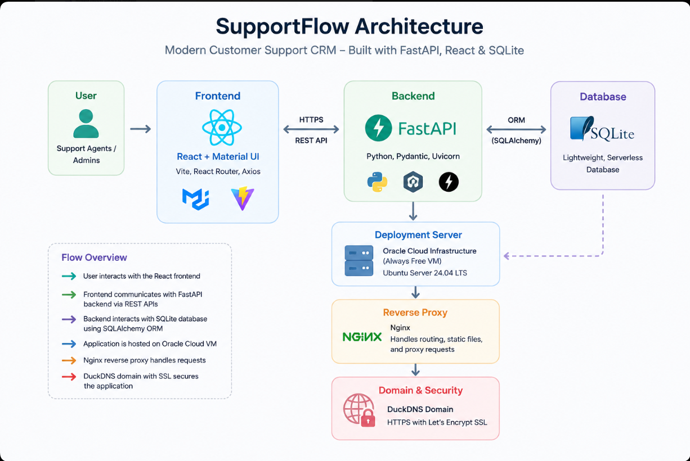
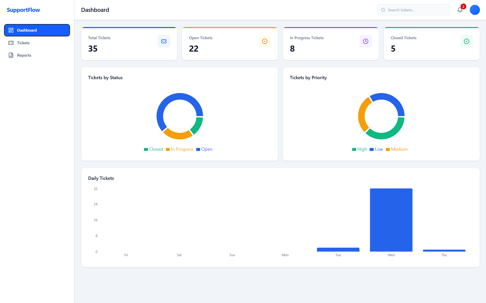
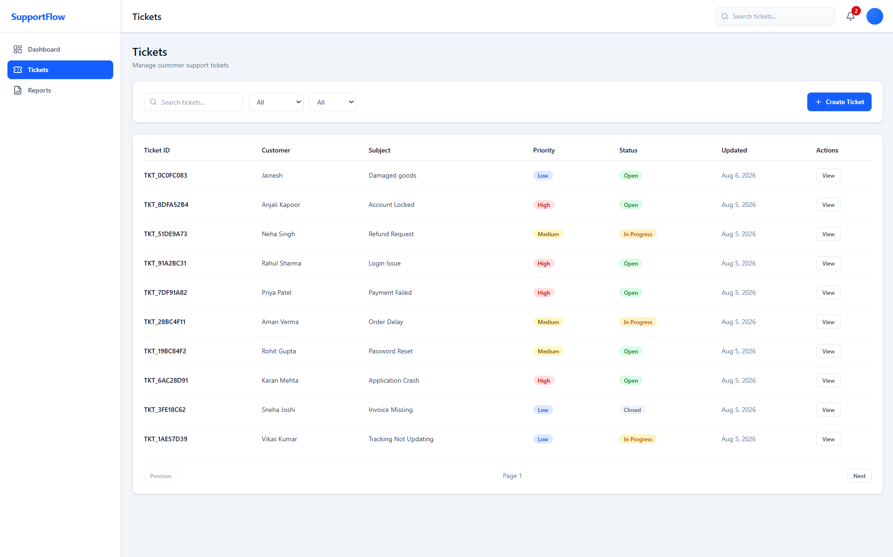
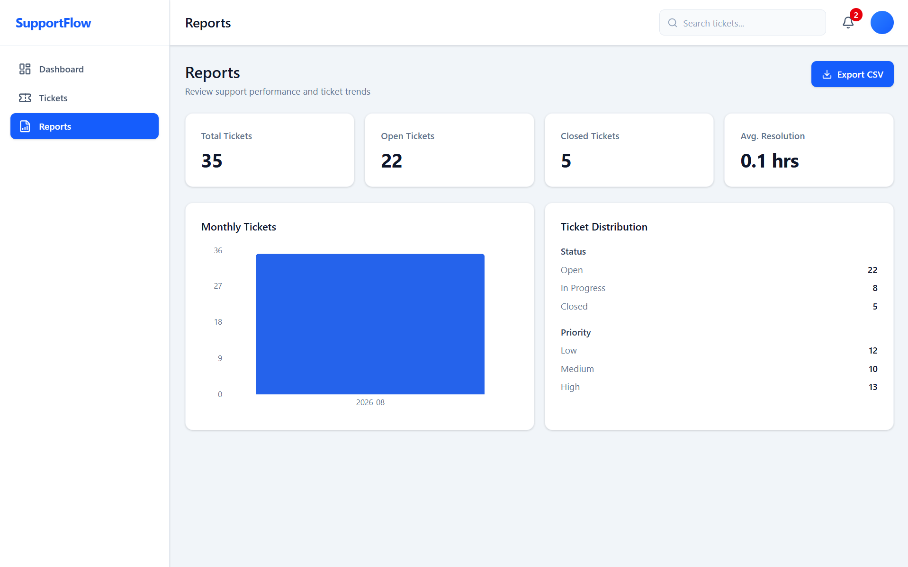

# 🚀 SupportFlow

### Modern Customer Support CRM

A production-ready customer support management platform built with **FastAPI**, **React**, and **SQLite**, designed to simplify ticket management through an intuitive dashboard, real-time analytics, and a scalable full-stack architecture.

 

🌐 **Live Demo:** https://supportflowapp.duckdns.org

📂 **GitHub Repository:** https://github.com/Curse395/SupportFlow

---

## 📖 Overview

SupportFlow is a full-stack Customer Support CRM that enables organizations to efficiently manage customer support tickets from creation to resolution. The application provides a centralized workspace where support teams can create, track, update, and organize tickets while gaining valuable insights through an interactive analytics dashboard.

Built with a modern technology stack, SupportFlow follows industry-standard software engineering practices including RESTful API development, modular backend architecture, responsive frontend design, database normalization, and production deployment on a cloud server.

This project was developed as part of the **Datastraw AI + Tech Internship Assessment**, with a focus on delivering a production-ready application that demonstrates end-to-end full-stack development, clean architecture, and real-world deployment.

---

## ✨ Features

### 🎫 Ticket Management

- Create new customer support tickets
- Auto-generated Ticket IDs
- Update ticket status and priority
- View detailed ticket information
- Add internal notes to tickets

### 🔍 Search & Organization

- Real-time ticket search
- Filter tickets by status
- Sort tickets efficiently
- Quick access to ticket details

### 📊 Dashboard & Analytics

- Total ticket statistics
- Open, In Progress, and Closed ticket metrics
- Priority distribution
- Status distribution
- Category-wise analytics
- Interactive charts and reports

### 🎨 User Experience

- Modern Material UI interface
- Responsive dashboard layout
- Sidebar navigation
- Ticket detail drawer
- Modal-based ticket creation
- Clean and intuitive user interface

### ☁️ Production Deployment

- Cloud-hosted application
- Secure HTTPS access
- Custom domain configuration
- Production-ready backend architecture

## 🛠️ Tech Stack

| Category | Technologies |
|----------|--------------|
| **Frontend** | React.js, Vite, Material UI (MUI), React Router, Axios |
| **Backend** | FastAPI, Python, SQLAlchemy, Pydantic, Uvicorn |
| **Database** | SQLite |
| **Deployment** | Oracle Cloud Infrastructure (Always Free VM), Ubuntu Server 24.04 LTS, Nginx, DuckDNS, Let's Encrypt |
| **Version Control** | Git, GitHub |

## 🏗️ System Architecture

The architecture below illustrates how SupportFlow is structured, from the React frontend to the FastAPI backend, SQLite database, and production deployment on Oracle Cloud Infrastructure.

  
   
  <em>Figure 1. High-level architecture of SupportFlow.</em>

## 📸 Application Screenshots

### Dashboard

  
   
  <em>Figure 2. Dashboard providing an overview of ticket statistics, analytics, and support operations.</em>

---

### Ticket Management

  
   
  <em>Figure 3. Ticket management interface with search, filtering, sorting, and detailed ticket information.</em>

---

### Reports & Analytics

  
   
  <em>Figure 4. Reports dashboard visualizing ticket trends, status distribution, priority, and category analytics.</em>

## 📡 API Endpoints

SupportFlow exposes a RESTful API for managing customer support tickets and related operations.

| Method | Endpoint | Description |
|--------|----------|-------------|
| `POST` | `/api/tickets` | Create a new support ticket |
| `GET` | `/api/tickets` | Retrieve all tickets with optional search and filtering |
| `GET` | `/api/tickets/{ticket_id}` | Retrieve detailed information for a specific ticket |
| `PUT` | `/api/tickets/{ticket_id}` | Update ticket status and add notes |

## 🚀 Deployment

SupportFlow is deployed on a production-ready cloud infrastructure using Oracle Cloud Infrastructure (OCI).

| Component | Technology |
|-----------|------------|
| **Cloud Provider** | Oracle Cloud Infrastructure (OCI) |
| **Operating System** | Ubuntu Server 24.04 LTS |
| **Backend Server** | FastAPI + Uvicorn |
| **Reverse Proxy** | Nginx |
| **Database** | SQLite |
| **Domain** | DuckDNS |
| **SSL Certificate** | Let's Encrypt |

🌐 **Live Application:** https://supportflowapp.duckdns.org

## 👨‍💻 Author

**Mohd Zahir Khan**

- GitHub: https://github.com/Curse395
- LinkedIn: https://www.linkedin.com/in/zahir-khan-4169ab279/

If you found this project interesting, consider giving it a ⭐ on GitHub.